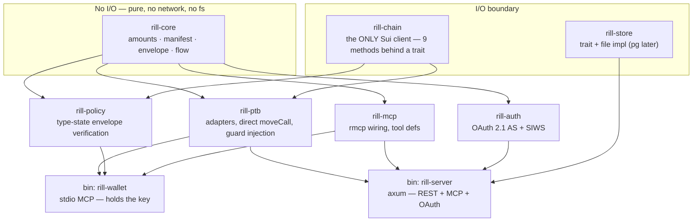
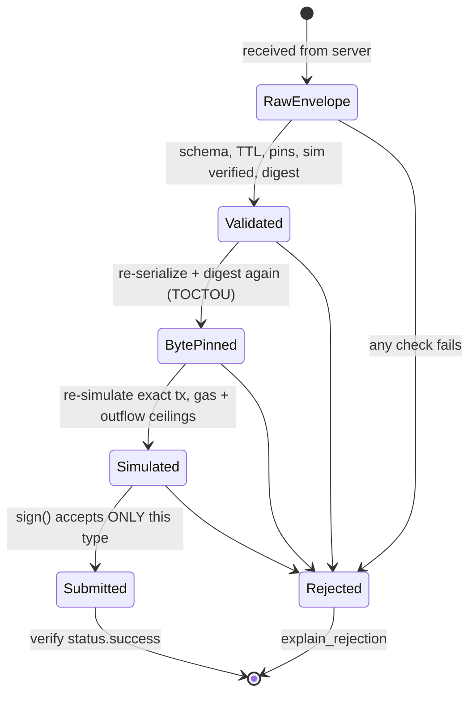
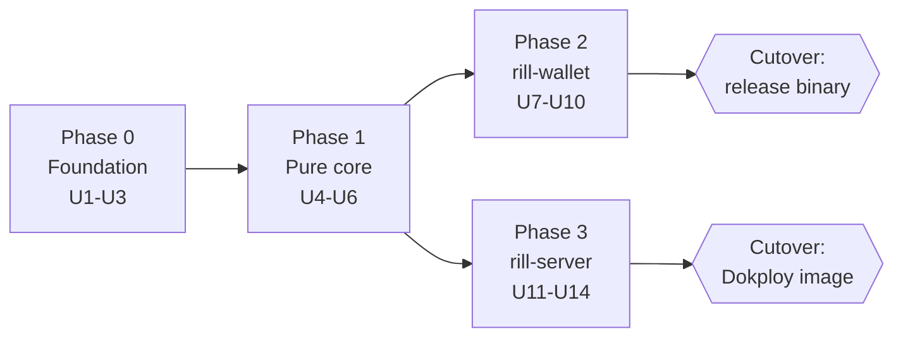

# feat: Rill in Rust — greenfield rebuild

**Target repo:** `~/rill` (new). The existing Bun/TypeScript Rill stays running and untouched; it serves as the **reference implementation and specification**, not as something being edited.

---

## Goal Capsule

Rebuild Rill — the keyless transaction layer for AI agents on Sui — as a Rust workspace, taking the opportunity to fix three structural problems the TypeScript version cannot fix without a rewrite anyway.

The old repo's **746 passing tests are the specification.** This is not a from-scratch design exercise; it is a re-expression of proven behavior in a language that makes the proven invariants structural instead of aspirational.

**Horizon:** ~6 months, to Sui mainnet and a pitch. Team expected to grow.

---

## Problem Frame

The TypeScript implementation works and is well-engineered, but the review that preceded this plan surfaced three problems that are all the same problem: **invariants the code documents but the language does not enforce.**

1. **A money-path float.** `price`/`quantity` flow as JavaScript `number` (`node-config.ts:265-266`, `api.schema.ts:153`) into DeepBook's `convertPrice`, which computes `BigInt(Math.round(value * scalar))`. The repo's own KTD-2 invariant says *"No IEEE-754 ever touches a token amount"*, and `rill-sdk/src/amounts.ts` exists solely to enforce it. The hero path bypasses it. All 746 tests pass — none assert price precision.

2. **The signer has drifted off the deployed contract.** `agent_wallet::spend` no longer exists (v3 replaced it with `request_spend` → rule `prove` → `confirm_spend`), but both the legacy and generic validation paths still require it (`policy.ts:193`, `policy.ts:1190`). `create_run_set` emits a policy with no `capabilityManifest`, no `versionId`, and no `steps`, which dispatches to exactly those dead paths. **The only run-set the product can create can never validate an envelope.** ~620 of policy.ts's 1,462 lines are unreachable against the deployed contract.

3. **One contract, three implementations.** `capability-manifest.ts` (515 LOC) is imported by backend, frontend, and signer. `toDeclaration` output is rendered by *both* the frontend directly and the backend's `/api/capabilities/preview` — and the two must agree exactly, with nothing enforcing that they do.

A port that faithfully reproduces the TypeScript would reproduce all three. The architecture below makes each one structurally impossible.

---

## Requirements

- **R1** — Behavior parity with the reference implementation for every path that is live against the **deployed v3 contract**. Dead v2 paths are not ported.
- **R2** — The keyless build / local sign / on-chain gate split is preserved exactly: the server never holds a key; the signer never trusts server bytes without independent inspection.
- **R3** — No floating-point arithmetic may touch a token amount, enforced by the type system rather than by convention.
- **R4** — The existing HTTP contract is preserved byte-for-byte so `rill-frontend` runs against the Rust server with zero changes, including the two distinct error-envelope shapes.
- **R5** — Move contracts are carried over unchanged. No Move work in this plan.
- **R6** — Existing `data/skills.json` and `data/oauth.json` files must load without migration.
- **R7** — The deployment path (GHCR image, Dokploy webhook, port 3939, `GET /health`) keeps working.
- **R8** — Distributed binary keeps the exact release asset names (`rill-wallet-darwin-arm64`, `-darwin-x64`, `-linux-x64`) — the old repo asserts them in tests and hands them to users in generated docs.

---

## Key Technical Decisions

### KTD-1 — Purity is enforced by the dependency graph, not by discipline

66% of the reference backend (5,250 of 7,941 LOC) is pure logic. In the new workspace that logic lives in `rill-core`, which **has no Sui client, no HTTP, and no filesystem in its dependency list**. It cannot perform I/O because it cannot name anything that does.

This is the central architectural bet. It makes the majority of the system testable with no network, no fixtures, and no mocks.

### KTD-2 — Exactly one crate may talk to Sui

The whole reference codebase uses only **9 distinct Sui client methods**: `getObject`, `listCoins`, `getBalance`, `simulateTransaction`, `signAndExecuteTransaction`, `waitForTransaction`, `readBlob`, client-backed `toJSON`, and offline `verifyPersonalMessageSignature`.

Nine methods behind one trait in `rill-chain`. Every other crate takes that trait as a parameter, so every other crate tests against an in-memory fake.

### KTD-3 — Validation state is carried in the type, not in a boolean

The reference signer runs ~15 checks then calls `sign()`. Nothing prevents a future refactor from calling `sign()` first. In Rust the envelope moves through distinct types:

`RawEnvelope` → `Validated` → `BytePinned` → `Simulated` → signable

`sign()` accepts only the last one. **Skipping a check becomes a compile error**, not a code-review catch. This is the single most valuable thing Rust buys here, and it is the honest answer to "why Rust" — not speed.

### KTD-4 — Integer-only money, with cross-language conformance vectors

`rill-core::amounts` exposes no constructor from `f64`. Prices and quantities are `u64` base units end-to-end. A shared JSON fixture file of test vectors is read by **both** `cargo test` and the old repo's `bun test`, so the two implementations are provably in agreement — and the reference implementation's float bug shows up as a failing vector.

### KTD-5 — No protocol SDK on the money path

`@mysten/deepbook-v3`'s `placeLimitOrder` is one `pool::place_limit_order` moveCall plus a trade proof and scalar conversion. The reference already hand-builds `balance_manager::deposit`, Cetus `router::swap`, and Haedal `request_stake` directly. The third-party Rust DeepBook SDK (35 commits, 6 stars, not on crates.io) is not a dependency worth taking on the money path. All Move calls are written directly against `sui-transaction-builder`.

### KTD-6 — One producer for capability declarations

`toDeclaration` lives in `rill-core` and is exposed over HTTP by `/api/capabilities/preview`. The frontend stops computing it locally and renders what the server returns. The three-way duplication collapses to one implementation — this is why the frontend gets *simpler* despite the backend changing language.

### KTD-7 — Persistence behind a trait from day one

The reference stores are explicitly single-instance; their own comments say two replicas would each hold half the authorization codes. `rill-store` defines a trait with a file-backed implementation that reads the existing JSON formats unchanged (R6), leaving a Postgres implementation as a drop-in later. This removes the single-replica deployment constraint without doing the database work now.

### KTD-8 — Hand-roll the OAuth authorization server

Verified: no maintained Rust crate provides the AS side with the RFC set Rill needs. `oxide-auth` (0.6.1, last release 2024-06-02) has PKCE but no axum frontend and nothing for RFC 7591/8707/9728. `oauth2-test-server` is explicitly in-memory for testing. `rmcp`'s `auth` feature is client-side only.

The reference AS is ~1,200 lines of HMAC, PKCE, and base64url — it ports cleanly. The Rust win is type-level grant/token state, not a library.

### KTD-9 — Pin every dependency exactly

All Sui crates are `0.x` (`sui-sdk-types` 0.3.2, `sui-transaction-builder` 0.3.2, `sui-crypto` 0.3.1, `sui-rpc` 0.3.2), where a minor bump may break. axum is 0.8.9 with **no 1.0 shipped** and 0.9 breaking changes already accumulating on `main`. Use `=` version pins and schedule deliberate upgrades, never `^`.

---

## High-Level Technical Design

### Crate graph — arrows are dependencies; nothing points back into `rill-core`



`rill-core` is a sink: everything depends on it, it depends on nothing of ours. That is what makes KTD-1 checkable — `cargo tree -p rill-core` must never show `sui-rpc`, `axum`, or `tokio`.

### The type-state chain that makes KTD-3 real



Each transition consumes the previous value. There is no path from `RawEnvelope` to `sign()`.

### Migration sequence — four phases, each independently shippable



Phases 2 and 3 both depend only on Phase 1, so they can run in parallel once the core lands — relevant as the team grows.

---

## Output Structure

```
rill/
├── Cargo.toml                  # workspace, pinned deps in [workspace.dependencies]
├── crates/
│   ├── rill-core/              # PURE — no I/O in its dependency graph
│   │   ├── src/amounts.rs      # u64 base units; no f64 constructor exists
│   │   ├── src/manifest.rs     # capability manifest + to_declaration (sole producer)
│   │   ├── src/envelope.rs     # ExecutionEnvelope types + digest
│   │   └── src/flow.rs         # FlowGraph, topo sort, structural validation
│   ├── rill-chain/             # the only Sui client — 9 methods behind SuiRead/SuiWrite
│   ├── rill-ptb/               # adapters: deepbook, cetus, haedal, guard
│   ├── rill-policy/            # type-state envelope verification
│   ├── rill-mcp/               # rmcp wiring + tool definitions
│   ├── rill-auth/              # OAuth 2.1 AS + SIWS
│   └── rill-store/             # persistence trait + file impl
├── bins/
│   ├── rill-server/            # axum
│   └── rill-wallet/            # stdio MCP signer
├── move/                       # carried over unchanged from the reference repo
├── ts/rill-types/              # generated from rill-core for the frontend
├── fixtures/                   # cross-language conformance vectors
└── docs/plans/
```

---

## Implementation Units

### Phase 0 — Foundation

#### U1. Workspace scaffold with pinned dependencies

**Goal:** A `cargo build` and `cargo test` that pass on an empty workspace with every crate boundary declared.

**Requirements:** R1
**Dependencies:** none
**Files:** `Cargo.toml`, `crates/*/Cargo.toml`, `crates/*/src/lib.rs`, `bins/*/Cargo.toml`, `rust-toolchain.toml`, `.github/workflows/ci.yaml`

**Approach:** Declare all eight crates and two binaries with their real dependency edges but empty bodies. Pin every external dependency with `=` in `[workspace.dependencies]` (KTD-9). Toolchain pinned to the installed 1.96.0.

**Test scenarios:**
- `cargo build --workspace` succeeds
- `cargo tree -p rill-core` contains none of `sui-rpc`, `axum`, `tokio`, `reqwest` — this is the KTD-1 guard and should be a CI step, not a habit
- CI runs `cargo test --workspace`, `cargo clippy -- -D warnings`, `cargo fmt --check`

**Verification:** CI green on an empty workspace before any logic exists.

---

#### U2. Carry over the Move packages

**Goal:** `move/agent_wallet` and `move/rill_guard` present and passing their own tests, unchanged.

**Requirements:** R5
**Dependencies:** U1
**Files:** `move/agent_wallet/**`, `move/rill_guard/**`, `.github/workflows/ci.yaml`

**Approach:** Copy verbatim from the reference repo, including `Published.toml`. Add the Move CI job pinning `SUI_CLI_VERSION` as the reference does.

**Execution note:** Before copying, resolve which deployed `agent_wallet` address is authoritative — the reference repo's README and `pitch.tsx` name `0xd9265581…`, while its `Published.toml` and `.env.example` name `0xb02f39d6…`. Record the verified answer in this repo's README; do not carry the ambiguity forward.

**Test scenarios:** `sui move test` passes for both packages (reference counts: 25 and 2).

---

#### U3. Cross-language conformance fixtures

**Goal:** A fixture format both `cargo test` and the reference repo's `bun test` can read, covering the money path.

**Requirements:** R3
**Dependencies:** U1
**Files:** `fixtures/amounts.json`, `fixtures/README.md`, `crates/rill-core/tests/conformance.rs`

**Approach:** JSON vectors of `{input, decimals, expected_base_units}` plus the DeepBook price/quantity scalar conversions. This is the artifact that proves KTD-4 rather than asserting it.

**Execution note:** Write the vectors first, from the reference implementation's *intended* behavior (its documented KTD-2 invariant), not from its actual output. Vectors that the reference fails are the float bug — expected and documented, not a reason to weaken the vector.

**Test scenarios:**
- Every vector round-trips through `rill-core::amounts`
- Scientific notation, excess precision, and values above `u64::MAX` are rejected
- A price like `1234.5678` at cross-scalar conversion produces the exact integer, not a rounded float result
- No public constructor accepting `f64` exists (compile-fail test via `trybuild`)

---

### Phase 1 — The pure core

#### U4. `rill-core::amounts` and `envelope`

**Goal:** The money path and envelope types, with the digest that both sides derive identically.

**Requirements:** R1, R3
**Dependencies:** U3
**Files:** `crates/rill-core/src/amounts.rs`, `crates/rill-core/src/envelope.rs`, `crates/rill-core/tests/`

**Approach:** Port `rill-sdk/src/amounts.ts` (91 LOC) and `execution-envelope.ts` (48 LOC). Digest is SHA-256 over the UTF-8 bytes of the base64 string, matching the reference exactly so envelopes stay interchangeable during cutover. Use `#[serde(deny_unknown_fields)]` for the Zod `.strict()` equivalent.

**Patterns to follow:** reference `packages/rill-sdk/src/amounts.ts`, `envelope.schema.ts` (strict at every nesting level).

**Test scenarios:**
- All `fixtures/amounts.json` vectors pass
- An envelope with one extra unknown field at any nesting level fails to deserialize
- Digest of a known base64 payload matches the reference implementation's output byte-for-byte
- `verification` accepts only `verified` / `unverified` — there is no `failed` variant

---

#### U5. `rill-core::manifest` — the sole declaration producer

**Goal:** Capability manifest types, `to_declaration`, `to_on_chain_rule_params`, `to_signer_policy`.

**Requirements:** R1, and KTD-6
**Dependencies:** U4
**Files:** `crates/rill-core/src/manifest.rs`, `crates/rill-core/tests/manifest.rs`

**Approach:** Port `rill-sdk/src/capability-manifest.ts` (515 LOC). Rule ordering for `to_on_chain_rule_params` must match what the Move `confirm_spend` receipt set expects — note the on-chain check is order-*independent*, so ordering is a convention here, not a security property.

**Test scenarios:**
- `to_declaration` output (`summary_lines`, `caps[].enforcement`) matches reference fixtures exactly — capture them from the reference before starting
- Each rule kind maps to its Move module's expected params
- A manifest-less wallet binding is rejected (the reference returns 422; no legacy path)

---

#### U6. `rill-core::flow` — graph validation and topological sort

**Goal:** FlowGraph structure checks and dependency ordering, with no PTB building.

**Requirements:** R1
**Dependencies:** U4
**Files:** `crates/rill-core/src/flow.rs`, `crates/rill-core/tests/flow.rs`

**Approach:** Port the structural gate and topological sort from `compiler.service.ts` — unique ids, real edge endpoints, registered handles, cycle detection. Config/inputs/runtime precedence from `node-config.ts` (311 LOC).

**Test scenarios:**
- A cycle is rejected with a named error, not a hang or stack overflow
- Duplicate node ids, dangling edges, and unregistered handles each rejected distinctly
- Runtime-parameter precedence is `config < inputs < runtime`
- A runtime key not allowed for any node is rejected
- Node count above the cap (reference: 20) is rejected

---

### Phase 2 — `rill-wallet`

#### U7. `rill-chain` — the Sui boundary

**Goal:** The 9 Sui methods behind a trait, with an in-memory fake for tests.

**Requirements:** R1, R2, and KTD-2
**Dependencies:** U1
**Files:** `crates/rill-chain/src/lib.rs`, `crates/rill-chain/src/fake.rs`, `crates/rill-chain/tests/`

**Approach:** `SuiRead` (get_object, list_coins, get_balance, simulate) and `SuiWrite` (execute, wait) traits over `sui-rpc` 0.3.2. Simulation uses `execution_client().simulate_transaction()` — verified present in the stable v2 proto, with **no `signatures` field** on the request, which is what makes keyless simulation the designed path rather than a workaround.

**Execution note:** Spike this unit first against a real testnet fullnode before the rest of Phase 2 depends on it. The one thing not verified from documentation is field-level parity between `SimulateTransactionResponse` and what the reference's classifier reads from `@mysten/sui`. Confirm the classifier can still distinguish verified / unverified / failed.

**Test scenarios:**
- Simulation of a known-good unsigned PTB returns success with command outputs
- Simulation classification: an RPC transport error becomes a classified failure, never a panic
- The Cetus `checked_package_version` abort maps to `unverified`, and only when the error names one of the curated Cetus package ids (not a bare substring match)
- Every consumer compiles against the fake with no network

---

#### U8. `rill-ptb` — adapters and guard injection

**Goal:** FlowGraph → one unsigned PTB, and PTB reconstruction for the signer.

**Requirements:** R1, and KTD-5
**Dependencies:** U6, U7
**Files:** `crates/rill-ptb/src/{lib,deepbook,cetus,haedal,guard}.rs`, `crates/rill-ptb/tests/`

**Approach:** Direct `sui-transaction-builder` Move calls, no protocol SDK. DeepBook limit order is `balance_manager::deposit` + trade proof + `pool::place_limit_order` with its 12 arguments and 2 type arguments. Funding flows through `agent_wallet::request_spend` → rule `prove` calls → `confirm_spend` — **the v3 shape, not the retired `spend()`**.

**Test scenarios:**
- A DeepBook flow compiles to the exact command sequence the v3 contract expects
- Cetus zero-coin pattern: exactly one `coin::zero` for the unfunded side; a second one is rejected
- Haedal below the 1 SUI minimum is rejected before building, not at execution
- A guardrail with `min_value <= 0` produces a warning and enforces nothing — it must never look enforced
- `min_out > 0` with no guard package configured throws rather than emitting an unguarded PTB
- The settle sweep never loses a coin: non-SUI leftovers transfer to sender, and a missing sender is an error

---

#### U9. `rill-policy` — type-state verification

**Goal:** The ~880 irreplaceable checks, expressed as consuming type transitions.

**Requirements:** R1, R2, and KTD-3
**Dependencies:** U5, U8
**Files:** `crates/rill-policy/src/{lib,states,inspect,capabilities}.rs`, `crates/rill-policy/tests/`

**Approach:** Port **only** the manifest-gated inspector and the universal envelope checks. Explicitly **do not port**: the legacy `inspect()` path, `validateLegacyEnvelope`, `validateGenericEnvelope`, or `inspectGeneric` — all four require `agent_wallet::spend`, which the deployed contract no longer has.

Drop the checks the chain already enforces unbypassably (`request_spend` argument pins, the ordered-`prove` requirement, revoked/expiry/budget re-reads) to defense-in-depth status or omit them. **Add the one check the reference is missing:** `cap_id` equality, so a stale cap after `rotate_agent` fails locally instead of aborting on-chain.

**Execution note:** This is the highest-risk unit. Port check-by-check against the reference's 66 `policy.test.ts` cases, converting each to Rust before writing the next check.

**Test scenarios:**
- TTL expired, and TTL longer than 5 minutes, both rejected
- Simulation accepted only when `ok && verification == verified`; `unverified` always rejected — there is no opt-in flag
- Digest mismatch rejected; byte-pin recomputed after validation catches a payload swapped in between
- Target sequence must match exactly; an off-scope target is rejected
- Both spend ceilings enforced independently — relaxing one must not relax the other
- `minimum_remaining` reserve floor enforced (no on-chain equivalent exists)
- Stale `AgentCap` after rotation is rejected locally
- Compile-fail test: `sign()` cannot be called on a `RawEnvelope` or a `Validated`

---

#### U10. `bins/rill-wallet` — stdio MCP signer

**Goal:** The distributed binary, feature-equal to the reference's live tool set.

**Requirements:** R1, R2, R8
**Dependencies:** U9
**Files:** `bins/rill-wallet/src/{main,tools,keystore}.rs`, `.github/workflows/release.yaml`

**Approach:** `rmcp` 3.1.4 with `transport-io`. Tools: `wallet_status`, `list_capabilities`, `execute_rill_action`, `explain_rejection`, `signer_status`, `list_run_sets`, `create_run_set`, `get/set_onboarding_config`, `request_faucet`. Declare MCP tool **annotations** the reference omits — `execute_rill_action` is `destructiveHint: true`; the read-only tools are `readOnlyHint: true`. Namespace tool names to avoid collision with other connected servers.

**`create_run_set` must emit a v3-shaped policy** carrying `capability_manifest` and `version_id` — the reference's omission of these is what makes its only run-set unvalidatable.

Keys via `sui-crypto`, multi-scheme, never persisted in the config after derivation. Mainnet refuses to sign without explicit opt-in.

**Test scenarios:**
- MCP handshake: `initialize`, `tools/list`, `tools/call` over stdio
- A notification (no `id`) produces no response at all; a request without `id` is a spec-violation error, not a silent 202
- `create_run_set` output validates against `rill-policy` — the round trip the reference cannot currently complete
- Mainnet without opt-in refuses before any key is touched
- Release artifacts are named exactly `rill-wallet-darwin-arm64`, `-darwin-x64`, `-linux-x64`
- Binary size recorded and compared against the reference's 59 MB

---

### Phase 3 — `rill-server`

#### U11. `rill-store` and configuration

**Goal:** Persistence behind a trait, reading the reference's existing JSON files unchanged.

**Requirements:** R6, and KTD-7
**Dependencies:** U1
**Files:** `crates/rill-store/src/{lib,file}.rs`, `bins/rill-server/src/config.rs`

**Approach:** `SkillStore` and `OAuthStore` traits with file implementations. Atomic write via temp-file + rename; `oauth.json` written `0600`. `skills.json` is a JSON array whose `tool_defs` are **discarded and recomputed on load** — the Rust `build_tool_defs` must produce byte-identical JSON Schema, so this is a port of behavior, not just deserialization. `oauth.json` is four maps with epoch-millisecond expiries and read-and-delete single-use semantics for codes and refresh handles.

Boot config fails fast: mainnet without an OAuth signing secret or without a deployed guard package refuses to start.

**Test scenarios:**
- The reference's actual `data/skills.json` and `data/oauth.json` load without error
- Recomputed `tool_defs` are byte-identical to the reference's for the same flow
- A corrupt store file logs and starts empty rather than failing boot
- Authorization codes and refresh handles are single-use; a replay finds nothing
- An agent-kind authorization request cannot be redeemed by the studio flow, and vice versa

---

#### U12. `rill-auth` — OAuth 2.1 authorization server

**Goal:** The AS, hand-rolled, with grant state in the type system.

**Requirements:** R1, R4, and KTD-8
**Dependencies:** U11
**Files:** `crates/rill-auth/src/{lib,tokens,siws,server}.rs`, `crates/rill-auth/tests/`

**Approach:** Port `oauth.service.ts` (687 LOC), `tokens.ts` (138), `siws.ts` (108). HMAC-SHA256 tokens with type and audience inside the MAC. PKCE S256 only. Dynamic client registration with the redirect-URI policy (https, loopback http, or private-use scheme; no fragment). Constant-time MAC comparison.

**Test scenarios:**
- A refresh token presented as a bearer at the MCP endpoint is rejected — type is signed
- A token minted for a different audience is rejected
- An error about an unregistered `redirect_uri` is **never** redirected to that URI
- `client_name` control characters and quotes are stripped before entering the wallet-signed message
- Refresh rotation: redeeming invalidates the old handle; replay fails
- Authorization code is single-use and bound to both client and redirect URI
- SIWS: the address is derived from the signature, never read from the request body; zkLogin signatures are refused rather than failing open

---

#### U13. `rill-mcp` and the MCP endpoints

**Goal:** Both MCP surfaces — public per-skill and OAuth-protected owner-scoped.

**Requirements:** R1, R4
**Dependencies:** U8, U12
**Files:** `crates/rill-mcp/src/{lib,tools,scope}.rs`, `bins/rill-server/src/routes/mcp.rs`

**Approach:** `rmcp` with `transport-streamable-http-server`. `StreamableHttpService` implements `tower::Service` with `Error = Infallible`, so it mounts into the axum router via `route_service` — tower is the seam, there is no axum-specific feature flag.

Scope is the only difference between the two endpoints: one skill unauthenticated, or every skill owned by the token's Sui address. An empty owner catalogue must still complete the handshake. Add pagination to `list_actions`, which the reference lacks and which now matters because one address may own up to the store cap.

**Test scenarios:**
- Batch requests answered as an array, omitting notifications; an all-notification batch returns 202 with no body
- An empty batch array is a distinct error
- Owner scope with zero published skills completes `initialize` and returns an empty `list_actions`
- An action id belonging to another address is indistinguishable from one that does not exist
- Every 401 carries `WWW-Authenticate` with the protected-resource metadata pointer
- Keyless guard: any argument whose normalized key is `execute`/`force`/`private_key`/`mnemonic` is refused on every `tools/call`
- A build refusal surfaces as an MCP error, never as content that could be mistaken for signable

---

#### U14. `bins/rill-server` — axum routes, OpenAPI, and deployment cutover

**Goal:** The HTTP surface, byte-compatible with what the frontend expects, deployed through the existing pipeline.

**Requirements:** R4, R7
**Dependencies:** U13
**Files:** `bins/rill-server/src/{main,routes/*}.rs`, `Dockerfile`, `.github/workflows/build-backend.yaml`

**Approach:** axum 0.8.9. **Two error-envelope shapes must be preserved exactly:** `/api/*` returns `{success, data, error}` while `/oauth/*` returns `{success, data, error_description}`. The frontend rejects on `!success || !data`, so a success response must never omit `data`.

CORS: wildcard origin, no credentials, `Authorization` and `MCP-Protocol-Version` allowed, and `WWW-Authenticate` **exposed** — an unexposed response header is invisible to browser JavaScript and breaks discovery. 512 KB body limit. `/.well-known/*` and `/mcp` mount at the origin root, not under `/api`.

Dockerfile becomes a multi-stage Rust build producing a static-ish binary; `curl` stays for the healthcheck; `EXPOSE 3939`; `GET /health` returns 2xx. The Dokploy webhook and GHCR tags are unchanged. `data/` remains a volume — `.dockerignore` already excludes it.

**Execution note:** Capture the reference server's responses for every endpoint as golden fixtures *before* cutover, and assert the Rust server reproduces them. This is what makes "cutover per component" safe without running both in parallel.

**Test scenarios:**
- Golden-fixture parity for all 12 frontend-consumed endpoints
- `/api/*` errors use `error`; `/oauth/*` errors use `error_description`
- A 200 response never has a null or absent `data`
- Preflight succeeds for `Authorization` and `MCP-Protocol-Version`; `WWW-Authenticate` is readable by the browser
- A body above 512 KB returns 413 in the `{success:false}` shape
- `/api/introspect` still returns 501 — it is honest, not unimplemented
- Container healthcheck passes; the image runs on `linux/amd64`

---

## Scope Boundaries

**In scope:** the two Rust binaries, the seven crates, generated TypeScript types for the frontend, and the deployment cutover.

**Not in scope:**
- **Move contract changes.** Carried over as-is (R5).
- **The frontend.** Stays TanStack/TypeScript. It changes in exactly one way — deleting its local `to_declaration` path in favor of the server's (KTD-6) — and that is a follow-up, not a blocker.
- **The reference repo.** It keeps running and is not edited. Its float bug and v2/v3 drift are fixed *here*, by construction, not there.

### Deferred to Follow-Up Work

- Postgres implementation behind the `rill-store` traits, removing the single-replica constraint
- Frontend deletion of its local declaration path once `/api/capabilities/preview` is authoritative
- Fixing the reference repo's documentation drift (its README and CODEBASE_MAP describe `agent_wallet::spend`, which no longer exists) — worth doing before the pitch regardless of this plan
- Dropping the reference repo's two dependencies with zero import sites (`@modelcontextprotocol/sdk`, `bn.js`)

---

## Risks & Dependencies

| Risk | Likelihood | Mitigation |
|---|---|---|
| `SimulateTransactionResponse` fields don't map cleanly onto the reference's simulation classifier | Medium | U7 is spiked first against a real fullnode, before Phase 2 depends on it. This is the one unverified assumption in the plan. |
| Sui crates are all `0.x`; a minor bump breaks the build | High over 6 months | `=` pins (KTD-9); upgrades are scheduled units, never incidental |
| axum 0.9 lands mid-migration with breaking changes | Medium | Pin 0.8.9; hyper 1.0 underneath is committed to stability, so the blast radius is axum's own API |
| `to_declaration` output diverges from the reference and the frontend renders inconsistently | Medium | Golden fixtures captured from the reference in U5; KTD-6 then removes the second producer entirely |
| The team grows onto an unfamiliar language mid-migration | Medium | Phases 2 and 3 are independent after Phase 1; `rill-core` is pure and is the natural onboarding surface |
| `#[serde(deny_unknown_fields)]` is incompatible with `#[serde(flatten)]` | Low | Avoid `flatten` on strict boundaries; where composition is needed, hand-write `Deserialize` or assert an empty catch-all map |

**External dependencies:** `rmcp` 3.1.4 · `sui-sdk-types` 0.3.2 · `sui-transaction-builder` 0.3.2 · `sui-crypto` 0.3.1 · `sui-rpc` 0.3.2 · `axum` 0.8.9 · `axum-test` 21.x · `tokio` · `serde` · `trybuild`. Verified to resolve together.

---

## Open Questions

- **Which deployed `agent_wallet` address is authoritative?** The reference's README and pitch deck say `0xd9265581…`; its `Published.toml` and `.env.example` say `0xb02f39d6…`. Resolve in U2 before anything binds to an address. *(Not a blocker for U1.)*
- **Does the reference's simulation classifier survive the field mapping in `sui-rpc`?** Answered by the U7 spike.
- **Does `~/rill` publish to a new GHCR path, or reuse `ghcr.io/eseslabs/rill-backend`?** Reusing means a single Dokploy cutover; a new path means both can run during verification. Decide before U14.

---

## Verification Contract

- `cargo test --workspace` passes
- `cargo clippy --workspace -- -D warnings` and `cargo fmt --check` pass
- `cargo tree -p rill-core` shows no I/O crate — the KTD-1 guard
- Every conformance vector in `fixtures/` passes in Rust
- `sui move test` passes for both Move packages
- Golden-fixture parity for all 12 frontend-consumed endpoints
- The reference repo's real `data/*.json` files load unchanged
- `rill-frontend`, unmodified, runs against `rill-server`
- Container healthcheck passes on `linux/amd64`

## Definition of Done

`rill-server` serves the existing frontend and existing MCP clients with no client-side changes; `rill-wallet` ships under its existing release asset names and can complete a run-set creation followed by a validated, signed, submitted DeepBook order against the v3 contract; both are deployed through the existing GHCR + Dokploy path; and `rill-core` has no I/O in its dependency graph.

---

## Sources & Research

- Reference implementation: `/Users/rifuki/mgodonf/web3/sui/deepsurge/rill` — backend 7,941 src / 6,217 test LOC, 281 tests, 66% pure logic; signer 3,156 / 3,737 LOC, 208 tests, one runtime dependency; 9 distinct Sui client methods across the whole repo
- `sui-rpc` 0.3.2 simulation: `TransactionExecutionServiceClient::simulate_transaction`, `SimulateTransactionRequest` has no `signatures` field — https://docs.rs/sui-rpc/0.3.2/
- `rmcp` 3.1.4 transports and its `tower::Service` seam — https://docs.rs/crate/rmcp/3.1.4/features
- No maintained Rust OAuth 2.1 AS: `oxide-auth` 0.6.1 last released 2024-06-02, no axum frontend — https://crates.io/crates/oxide-auth
- axum 0.8.9, no 1.0, 0.9 breaking changes on `main` — https://github.com/tokio-rs/axum/blob/main/axum/CHANGELOG.md
- `deny_unknown_fields` / `flatten` incompatibility — https://serde.rs/container-attrs.html
- DeepBook v3 Rust SDK is marked "(Unofficial)" by MystenLabs — https://github.com/MystenLabs/deepbookv3
