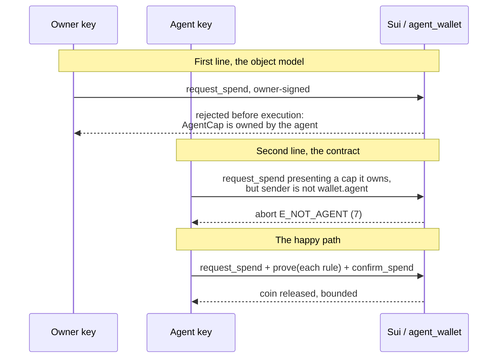
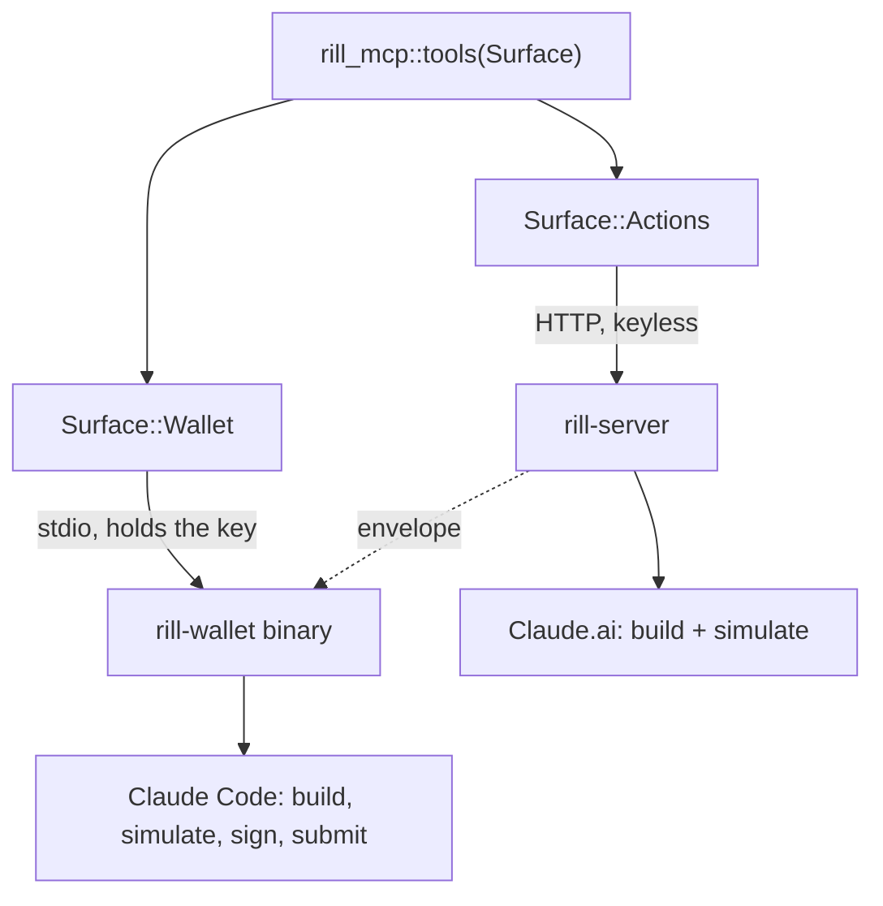
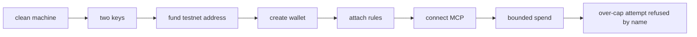

# feat: Rill verifiable. The thesis is proven; now make a stranger able to check it

**Target repo:** `~/rill`, baselined against HEAD `55d6b7b` (2026-09-03). The Bun/TypeScript Rill
remains the specification and is not edited.

> **Re-baseline note.** The first draft of this plan was written from `docs/OVERNIGHT.md` and
> `README.md`, both of which predate the six commits that landed on 2026-09-03. A review pass read
> the code instead and found that three of its four Phase A units re-planned finished work. This
> version is written from HEAD and verified against it. What that changes is the whole shape: the
> thesis is not unproven, it is unverifiable by anyone who is not sitting at this machine.

This plan supersedes the **Queue section** of `docs/OVERNIGHT.md`. That file's **State on chain**
table stays live and continues to be appended to.

---

## Goal Capsule

Rill works. A bounded spend lands on Sui testnet from an agent key that is not the owner's, the
owner is refused when it tries the same spend, `rill_execute` runs the whole path through submit, and
a gated spend has flowed into a DeepBook order inside one agent-signed transaction. All of it has
recorded digests.

**And none of it is checkable by anyone else.** The release pipeline produces nothing, the URL every
published instruction points at is dead, the install commands name three different GitHub
repositories, there is no path from a clean machine to a first spend, and the one property that makes
Rill different from a custodial server with good limits, that the builder never holds a key, has no
acceptance surface at all.

When this plan is done, a stranger gets from a clean machine to a bounded spend, watches the chain
refuse an over-cap attempt by name, and can see for themselves that the thing which built the
transaction could not have signed it.

---

## Problem Frame

The competitive research established the defensible claim: Rill is the only project found with a
keyless remote builder that introspects Move ABIs, compiles to one simulated PTB, and hands it to a
local signer that re-validates and re-simulates. It also established the failure mode to avoid: a
Sui competitor shipped a comparable contract to mainnet, drew three users, and went dark. Capability
nobody can check is worth nothing.

Rill is currently on the wrong side of that line, and not for want of capability.

### What is proven, with digests, and is not re-planned here

Verified against HEAD `55d6b7b` by reading the code, not the documents:

| Claim | Evidence |
|---|---|
| Two identities, explicit key selection | `--as <address>` in `bins/rill/src/main.rs`; commit `be5d9ea` |
| The delegation is real | `be5d9ea` records four testnet digests: wallet create, owner-only `add_rule`, agent spend, owner refused |
| `rill_execute` completes | `bins/rill/src/stdio.rs`: `pin_bytes` (376), re-simulate, sign, `SuiWrite::execute` (423), `"submitted": true` (441); commit `06df501` |
| The run-set exists | `bins/rill/src/runset.rs`, 322 lines, `RunSet::from_path`, `to_policy()`, own tests |
| DeepBook is provisioned and delegated | `crates/rill-ptb/src/balance_manager.rs`; commit `5dcd62e`, digest `6Y9xQaBui9WrXUxKWbbQRY3rN2GSSknY3C4dUZEXVRKp` |
| A gated spend reaches a real protocol | commit `4ebe18a` lands request_spend, prove, confirm_spend, deposit_with_cap, generate_proof_as_trader, place_limit_order as **one agent-signed transaction**, digest `GiL7unaYVnx7TF9QDtpUgc3nFSdWxVgkLb6sMDQfCm77` |
| The one-PTB-one-sender question | Settled empirically by `4ebe18a`. It is not an open risk. |
| Live rule reads, rule reconciliation, full lifecycle | `docs/OVERNIGHT.md` completed items, with digests |
| Reference gas price read per network | testnet 1000, mainnet 100 |
| MCP tool annotations | Test asserts only submitting tools are destructive |
| OAuth 2.1 authorization server | `/oauth/{authorize,register,revoke,token}`, RFC 8707 binding, exact `redirect_uri` match, refresh-as-bearer refused |
| Protocol version negotiation | Both transports declare `["2025-06-18","2025-03-26","2024-11-05"]` and echo the client's version only when supported |
| Per-asset checksums | `.github/workflows/release.yaml` already runs `shasum -a 256` and attaches six `.sha256` files |
| `PUBLIC_BASE_URL` as one configured value | `bins/rill-server/src/state.rs`; every route and discovery document derives from it |

### The correction that reframes the product claim

**The two MCP surfaces are disjoint by design, and that is correct.** `bins/rill-server/src/mcp.rs`
serves `Surface::Actions`, three keyless build tools. `bins/rill/src/stdio.rs` serves
`Surface::Wallet`, four tools including the one that spends. `crates/rill-mcp/src/lib.rs` states the
reason: *only the signer holds a key, and only it offers a tool that can spend.*

So "one URL, both Claude surfaces, same bounded spend" was never achievable, and achieving it would
mean signing on the server, which forfeits the differentiator. The honest claim is **one tool
surface, two transports, and only the local one can complete a signature.** Claude.ai builds and
simulates; Claude Code, where the binary lives beside the connector, completes.

---

## Requirements

| ID | Requirement |
|---|---|
| R1 | The owner-signed spend is refused **before execution**, because the `AgentCap` is an owned object the owner does not hold. `E_NOT_AGENT` (7) is exercised separately as the second line of defence. |
| R2 | Both already-recorded delegation runs are locked in as `#[ignore]`-gated live regression tests, so a regression cannot pass silently. |
| R3 | An agent can drive create and attach over MCP, not only spend, and a refusal names the rule that refused. |
| R4 | Every enforcement claim the product emits states the enforcement the code computes. |
| R5 | A tagged release produces installable binaries whose asset names match the published install instructions, from one resolved release origin. |
| R6 | The build path for every artifact, including the container image, fails if the lockfile would change. |
| R7 | The hosted endpoint answers at a stable URL, and no instruction Rill emits points at a URL that does not resolve. |
| R8 | A deployed agent with no browser can authenticate. |
| R9 | The HTTP transport offers the keyless build tools and the stdio transport offers the signing tools, both generated from one producer, and the difference is exactly the signing tools. |
| R10 | A stranger with no Sui setup reaches a bounded spend from a clean machine. |
| R11 | The stranger can observe that the builder never held a key. |
| R12 | No binary names a gas price literal in production code, and gas-object pagination is exercised by a test. |
| R13 | Every mainnet precondition is green on testnet, the cutover has a named trigger and owner, and it is not executed. |

---

## Key Technical Decisions

### KTD-1: Plan from the tree, not from the documents

This plan's first draft was wrong because `docs/OVERNIGHT.md` and `README.md` lagged the code by six
commits. Both are now themselves work items: U1 corrects the README, and the Queue section of
`OVERNIGHT.md` is retired here. Any future re-plan re-baselines against HEAD first.

### KTD-2: R1 is restated because the chain refuses earlier than the contract does

The original criterion demanded abort `E_NOT_AGENT` (7) on an owner-signed spend. That abort cannot
fire: the `AgentCap` is an owned object held by the agent, so Sui rejects the transaction on
ownership before execution begins. Commit `be5d9ea` recorded the real refusal and concluded that
`E_NOT_AGENT` is the second line of defence, not the first.

This is a better story than the original, not a weaker one: **two independent refusals, one from the
object model and one from the contract.** Say that, and test both.

### KTD-3: Two disjoint surfaces, one producer

Per the correction above. `rill_mcp::tools(Surface)` stays the single producer. The test asserts that
every tool appearing on both surfaces is identical and that the surfaces differ by exactly the
signing tools. It does not assert the lists are equal, because they must not be.

### KTD-4: Keep the hand-rolled MCP layer, and price the decision honestly

`rmcp` would provide dual-era negotiation and both elicitation modes. The measured surface here is
**1,682 lines**: `crates/rill-mcp/src/lib.rs` (426), `bins/rill-server/src/mcp.rs` (369) and
`bins/rill/src/stdio.rs` (887). The deferral holds, because a larger surface argues more strongly for
not rewriting it on the way to a demo. But the cost is not zero: U9's parity and protocol-version
work is the recurring price of keeping it. Recorded in Open Questions.

### KTD-5: Published instructions win, once there is one publisher

The release workflow's own header comment says asset names are a contract. It is right, and the
contract currently has three different counterparties: the TypeScript README curls
`naisu-one/rill`, `skill-doc.ts` emits `eseslabs/rill`, and this repository's remote is
`rifuki/rill`. **"Published instructions win" is meaningless until one origin is chosen.** U5 must
close that before its other work means anything.

Renaming the cargo bin is also not sufficient by itself: the emitted filename comes from the matrix
`asset:` values and the publish `files:` list, which are separate literals, and the smoke step greps
for a string the binary does not print.

### KTD-6: The keyless property becomes an acceptance surface

Every criterion in the first draft could pass while the defensible claim stayed invisible: a
custodial server with good limits reproduces "spend inside a cap, refused by name". The repository
already contains `crates/rill-chain/tests/keyless_simulation_live.rs`. Promote it from a test that
passes to **something the stranger can see**, and assert that the hosted surface exposes no signing
route.

### KTD-7: The slippage floor is pre-flight, and the document must say so

`rill_guard::assert_min_value` is injected by the builder and checked by the signer's
`check_guard_set` equality test. No Move rule requires its presence. The design is defensible,
because the signer is the trust anchor rather than the server, but calling it on-chain enforcement
would repeat exactly the error U1 fixes. State it as: **the floor is enforced by the signer refusing
to sign an envelope whose guard call does not match, and by the chain aborting when the floor is
breached.**

### KTD-8: Mainnet gets a trigger, not just a gate

"Mainnet-ready" with no trigger becomes permanent. U12 names the condition that opens the decision,
who authorizes it, and the audit's cost band.

---

## High-Level Technical Design

### The two refusals, which is the corrected thesis

### Two surfaces, one producer

The dotted arrow is the product. The server cannot complete it, and that is the claim.

### What a stranger has to do, which nothing currently owns

---

## Implementation Units

Phase A is no longer "prove the thesis". The thesis is proven. Phase A is **tell the truth about what
is proven**, and lock it so it stays proven.

### Phase A: Truth and regression

#### U1. Correct every enforcement claim the product emits

**Goal.** Nothing Rill emits claims enforcement the code does not compute.

**Requirements.** R4.

**Dependencies.** None.

**Files.**
- `crates/rill-core/src/manifest.rs`: `RuleKind::enforcement()`, the producer (already returns `Enforcement::PreFlight` for four kinds)
- `bins/rill/src/wallet_read.rs`: currently hardcodes `"enforcement": "on-chain"`
- `crates/rill-mcp/src/lib.rs`: the wallet-read description that calls the read "Authoritative" without the distinction
- `README.md`: the enforcement claims, the stale test count, and the "submission is unproven" passages
- `docs/OVERNIGHT.md`: retire the Queue section, keep the State on chain table
- `crates/rill-core/tests/manifest.rs`: extend (it already asserts `Enforcement::PreFlight`)

**Approach.** The producer exists and is correct. The consumers ignore it. Make `wallet_read.rs` emit
the computed label per rule rather than a constant, and make the MCP tool description carry the
distinction. Then correct the README: it says 323 tests when the count is higher, and it still says
submission is unproven and that a signature is the only thing missing, which six digests have since
refuted. Per KTD-7, state the slippage floor's enforcement accurately rather than as on-chain.

**Patterns to follow.** The repo's single-producer rule for capability declarations.

**Test scenarios.**
- A rule kind whose producer returns `PreFlight` renders as pre-flight in the wallet read.
- A rule kind whose producer returns on-chain renders as on-chain.
- Adding a rule kind without an enforcement arm fails to compile rather than defaulting.
- The wallet-read output contains no constant enforcement string.
- A snapshot of the emitted description contains no claim of destination or protocol scoping.

**Verification.** Grepping the repository for a hardcoded enforcement string returns nothing, and the
README's test count matches a real `cargo test --workspace` run.

---

#### U3. Lock the delegation proof into CI

**Goal.** The two refusals and the happy path become regression tests, so a regression cannot pass
silently.

**Requirements.** R1, R2.

**Dependencies.** None.

**Files.**
- `bins/rill/tests/delegation_live.rs`: new, `#[ignore]`-gated
- `move/agent_wallet/tests/agent_wallet_tests.move`: extend for the `E_NOT_AGENT` second line
- `docs/OVERNIGHT.md` State on chain table: the digests already recorded by `be5d9ea`

**Approach.** The manual proof landed in `be5d9ea` with four digests. What did not land is the
automation. Follow the repo's existing live-test style (`crates/rill-chain/tests/gas_live.rs`).

Per KTD-2, the owner-signed spend is refused by Sui's ownership check before execution, so assert
**that** refusal rather than abort 7. Cover `E_NOT_AGENT` separately with a transaction that presents
a cap its sender owns but whose sender is not `wallet.agent`, which is reachable as a Move unit test.

**Execution note.** Break each assertion and watch it fail before restoring it. Record both runs, per
the repo's existing rule that a test passing with and without the fix is worthless.

**Test scenarios.**
- Agent-signed `request_spend` inside the cap succeeds.
- Owner-signed `request_spend` is refused before execution, and the assertion matches on the
  ownership refusal rather than on a Move abort code.
- A sender that owns a cap but is not `wallet.agent` aborts `E_NOT_AGENT` (7), as a Move unit test.
- Agent-signed spend above the per-tx cap aborts with the per-tx abort, named.
- Owner-signed `add_rule` succeeds; agent-signed `add_rule` is refused.
- With `--as` omitted and more than one key in the keystore, the command refuses with a named error
  rather than silently signing with `RILL_SUI_PRIVATE_KEY` or the keystore's first entry. That
  fallback is the exact "whichever key comes first" pattern the design disowns, and `wallet create`
  mints a wallet's ownership from whatever key it picks.

**Verification.** `cargo test -- --ignored` reproduces every digest already in the State on chain
table, and the Move test suite covers abort 7.

---

#### U4. The multi-step surface an agent can actually drive

**Goal.** An agent creates and attaches over MCP, not only spends, and a refusal names the rule.

**Requirements.** R3.

**Dependencies.** U1.

**Files.**
- `bins/rill/src/stdio.rs`: the tool surface (`rill_status`, `rill_wallet`, `rill_spend`, `rill_execute` today)
- `bins/rill/src/runset.rs`: the run-set, which already exists
- `bins/rill/tests/execute_flow.rs`: new

**Approach.** `rill_execute` already runs through submit and the run-set already exists, so the
opening premise of the first draft is void. What remains is that the four tools do not describe a
multi-step flow: create and attach are owner commands run by hand, not tools an agent can drive. Add
them, and make every refusal path carry the rule name through to the MCP response rather than a
generic error.

**Execution note.** Start from a refusal. A tool that submits successfully but reports a refusal as an
opaque error has not met R3.

**Test scenarios.**
- An agent creates a wallet, attaches rules, and spends inside them, entirely over MCP.
- A spend that violates an attached rule returns a refusal naming that rule.
- A run without a run-set is refused before signing, naming what is missing.
- Re-issuing an execute call does not start a second operation.
- The annotation invariant still holds: only submitting tools are destructive.

**Verification.** From a Claude Code session and nothing else, an agent goes from no wallet to a
bounded spend and to a named refusal.

---

### Phase B: Make it installable

Phase B begins on day one, in parallel with Phase A. Phase A gates the claim; Phase B gates whether
anyone can check it.

#### U5. One release origin, and a tag that produces it

**Goal.** A tag produces installable assets whose names match the published instructions.

**Requirements.** R5.

**Dependencies.** None.

**Blocking open question this unit must close first.** Which GitHub origin publishes the release. The
target repo's remote is `rifuki/rill`; the TypeScript README curls `naisu-one/rill`; `skill-doc.ts`
emits `eseslabs/rill`. Until one is chosen, R5 has no meaning.

**Files.**
- `.github/workflows/release.yaml`: the `--bin` target, the three matrix `asset:` values, the publish `files:` list, the smoke step
- `bins/rill/Cargo.toml`: the `[[bin]]` alias
- `bins/rill/src/main.rs`: `status()`'s first printed line
- `bins/rill/src/stdio.rs`: `serverInfo.name`
- `README.md`: the install block

**Approach.** Four separate defects, each of which alone still produces a broken release:

1. The workflow builds `--bin rill-wallet`, which does not exist. Add the alias.
2. The emitted filename comes from the matrix `asset:` values and the publish `files:` list, not from
   the bin name. Rename those to the `rill-wallet-` prefixed forms.
3. The smoke step greps the binary's output for `rill-wallet`, but the binary prints `rill`. Change
   what it calls itself, in both `status()` and `serverInfo.name`.
4. Checksums already exist and are attached. Nothing to add there.

**Test scenarios.**
- `cargo build --bin rill-wallet` resolves.
- The emitted asset filename equals the name in the README install line.
- `rill-wallet --status` prints the string the smoke step greps for.
- The smoke step fails the job when handed a binary that cannot start.
- A dry-run tag on a scratch branch produces three assets and six checksum files.

**Verification.** The README's curl command, run on a machine that has never seen this repository,
downloads a binary that starts.

---

#### U6. Every build path refuses a lockfile change

**Goal.** The hosted image is built under the same supply-chain posture as the released binaries.

**Requirements.** R6.

**Dependencies.** U5.

**Files.**
- `Dockerfile`: the build line currently lacks `--locked`
- `.github/workflows/release.yaml`, `.github/workflows/ci.yaml`
- `README.md`: the verification instructions

**Approach.** The release path already uses `--locked`; the image build does not, so the hosted
server can silently resolve different dependency versions than the checksummed binaries. That is
exactly the exposure this unit exists to bound, given a campaign that steals Sui keystores through
`build.rs` during `cargo build`. Add `--locked` to the image, audit build scripts in the tree, pin
the toolchain, and make the checksum verifiable from the README alone.

**Test scenarios.**
- Every build path, CI, release and image, fails if `Cargo.lock` would change.
- A dependency introducing a new `build.rs` surfaces in CI rather than landing silently, by diffing
  `cargo metadata` against a checked-in baseline of build-script-bearing dependencies. `--locked` and
  a pinned toolchain stop an unreviewed version bump but do nothing about a new build script
  appearing inside an already-approved tree, which is the actual vector.
- The published checksum verifies against the published asset.
- The README verification command is copy-pasteable and correct.

**Verification.** A user can verify what they downloaded before running it, using only the README.

---

### Phase C: Make it reachable

#### U7. A host, and instructions that resolve

**Goal.** The hosted endpoint answers, and nothing Rill emits points at a dead URL.

**Requirements.** R7.

**Dependencies.** None. It does not depend on Phase A: none of its checks touch `rill_execute`.

**Files.**
- `Dockerfile`, `.github/workflows/ci.yaml`: the image build and healthcheck job, already written
- deployment configuration

**Approach.** `PUBLIC_BASE_URL` already is the single configured value and every route and discovery
document derives from it, so the configuration work the first draft proposed is done. What is open is
the host itself and its credentials. Resolve it and record the answer in the repository.

**Note on scope.** There is no `skill.md` generator in this repository; it lives in the TypeScript
repo, which Not goals forbids editing. See U13.

**Test scenarios.**
- `GET /health` returns success from the deployed host.
- `POST /mcp` without a bearer returns 401 with `WWW-Authenticate` pointing at discovery.
- Both `/.well-known` documents resolve and name this deployment.
- The container healthcheck fails the deploy when the process is unhealthy.

**Verification.** The URL in the README reaches a live server from a machine outside this network.

---

#### U8. A credential a deployed agent can use

**Goal.** An agent with no browser authenticates.

**Requirements.** R8.

**Dependencies.** U7.

**Files.**
- `crates/rill-auth/src/`, `bins/rill-server/src/`
- `crates/rill-auth/tests/long_lived_token.rs`: new

**Approach.** The OAuth server is complete and correct, and inert for deployed agents: seven of
eleven frameworks accept only a static bearer, and the Claude Agent SDK states it does not open a
browser and will continue without the server's tools, reporting `needs-auth`, which is a silent
failure. Issue a long-lived owner-scoped token for the build surface.

**Correction, found by review and load-bearing.** "Revocable through the existing `/oauth/revoke`"
is false against the current code. `/mcp` accepts only `TokenKind::Access`, which is a **stateless
HMAC** checked by signature and expiry with no revocation list. `/oauth/revoke` verifies and consumes
only `TokenKind::Refresh`, a store-backed handle. Calling revoke with an Access-kind token returns
`{"revoked": true}` and revokes nothing, because RFC 7009 requires a 200 whether or not the token
existed. A leaked long-lived bearer would stay valid for its entire lifetime with no signal that the
revoke was a no-op.

So this unit must add a **third, stateful token kind**: accepted by `/mcp` for bearer auth, checked
against the store on every request rather than only at issuance, and covered by `/oauth/revoke`'s
store-backed path. Without that, a long-lived credential is strictly worse than the interactive flow
it sits beside, which is the opposite of what this unit is for.

**Scope constraint, load-bearing.** The token must reach the **build** surface only. It must not
reach owner-side operations such as `add_rule`, `top_up` or `extend_expiry`, because a leaked
environment variable that can raise its own cap removes the bound the product is built on.

**Test scenarios.**
- A long-lived token authenticates on `/mcp`.
- The token cannot invoke any owner-side operation, and the refusal names why.
- The token is scoped to one owner and cannot reach another owner's wallet.
- Issuing a token, revoking it, then calling `/mcp` again fails on that very next call.
- Revocation is checked against the store per request, not only at issuance.
- A revoke call naming a token kind the store does not track is refused rather than silently
  returning success to an operator who would read it as revoked.
- A refresh token still cannot be presented as a bearer.
- Issuing requires owner authentication, not merely possession of another token.

**Verification.** A headless agent with only an environment variable builds and simulates, and cannot
change its own limits.

---

#### U9. Two surfaces, stated honestly, from one producer

**Goal.** The transports differ by exactly the signing tools, and the documentation says so.

**Requirements.** R9.

**Dependencies.** U4, U5, U7.

**Files.**
- `crates/rill-mcp/src/lib.rs`: `tools(Surface)`, the producer
- `bins/rill-server/src/mcp.rs`: `Surface::Actions`
- `bins/rill/src/stdio.rs`: `Surface::Wallet`
- `crates/rill-mcp/tests/surface_split.rs`: new
- `README.md`: the two install paths and what each can do

**Approach.** Per KTD-3, do not make the lists equal. Assert the split is exactly the signing tools,
and document the Claude.ai path as build-and-simulate with the envelope handed to a local signer.
Protocol-version negotiation is already correct on both transports; keep a regression test for it.

**Test scenarios.**
- Every tool present on both surfaces is identical across transports.
- The surfaces differ by exactly the signing tools, asserted by name.
- The HTTP surface exposes no route that can produce a signature.
- Both transports advertise the newest protocol version they support and echo a client's older
  supported version.
- A destructive tool is marked destructive wherever it appears.

**Verification.** The README tells a reader which surface can complete a spend and which cannot,
and the test would fail if a signing tool ever appeared on the HTTP surface.

---

### Phase D: Make it verifiable by a stranger

#### U13. The generated instructions, in this repository

**Goal.** The documents Rill hands agents are produced by Rill.

**Requirements.** R4, R7.

**Dependencies.** U1, U7.

**Files.**
- `bins/rill-server/src/`: the generator, new
- `bins/rill-server/src/state.rs`: `PUBLIC_BASE_URL`, already the single source
- `bins/rill-server/tests/generated_docs.rs`: new

**Approach.** The `skill.md` and agent-instructions generators live in the TypeScript repo, which is
out of scope to edit, so U1's correction cannot reach them and U7's URL cannot be interpolated into
them. Port the generator here, interpolating the existing configured base URL and the enforcement
labels U1 makes available.

**Open question this unit must close.** Whether the ported generator becomes authoritative over the
TypeScript one, and what keeps them from drifting while the TypeScript repo remains the stated
specification.

**Test scenarios.**
- A generated document interpolates the configured base URL and no literal host.
- A generated document states each rule's computed enforcement label.
- A generated document contains no claim of destination or protocol scoping.
- The install command in a generated document names the resolved release origin from U5.

**Verification.** Copying a command out of a freshly generated document and running it works.

---

#### U14. Cold start, owned by a unit

**Goal.** A stranger with no Sui setup reaches a bounded spend.

**Requirements.** R10.

**Dependencies.** U5, U9, U13.

**Files.**
- `bins/rill/src/`: an onboarding command
- `README.md`: the cold-start path
- `bins/rill/tests/cold_start.rs`: new

**Approach.** The Definition of Done says a stranger curls a binary and watches an agent spend. Between
those two clauses sit two keys, a funded testnet address, a created wallet and attached rules, and
nothing owns that path today. Provide it: generate or import both keys, print a faucet link, then
drive `create_wallet` and `add_rule` from one command.

**Execution note.** This is the unit most likely to look finished while still being unusable. The
verification below is deliberately a human one.

**Test scenarios.**
- On a machine with no Sui config, the command produces both keys without writing an existing keystore.
- The command prints a faucet link and waits rather than failing on an unfunded address.
- After funding, it creates a wallet and attaches at least one rule.
- It refuses to proceed with an empty rule set, and says why.
- Re-running is a no-op rather than a second wallet.

**Verification.** Someone who has not seen this repository completes the path using only the README,
and the time it took is recorded.

---

#### U15. Make the keylessness observable

**Goal.** The stranger can see that the builder could not have signed.

**Requirements.** R11.

**Dependencies.** U7, U9.

**Files.**
- `crates/rill-chain/tests/keyless_simulation_live.rs`: exists; promote it
- `bins/rill-server/src/`: the assertion that no signing route exists
- `README.md`: how a reader checks it themselves

**Approach.** Every other criterion in this plan can pass while the defensible claim stays invisible,
because a custodial server with good limits reproduces "spend inside a cap, refused by name". The
test proving keylessness already exists and proves it only to whoever runs the suite. Give the
stranger a way to check: the hosted surface exposes no signing route, and the envelope it returns is
unsigned and inert until the local binary validates it.

**Test scenarios.**
- `keyless_simulation_live` passes against the deployed host.
- The hosted surface exposes no route that returns a signature.
- An envelope taken from the HTTP surface cannot be submitted without the local signer.
- A tampered envelope is refused by the local signer, naming the mismatch.

**Verification.** A reader can run one documented command against the public host and see that it
builds a transaction it cannot sign.

---

#### U10. Gas that is read, not assumed

**Goal.** No production code names a gas price, and pagination is exercised.

**Requirements.** R12.

**Dependencies.** None.

**Files.**
- `bins/rill-server/src/mcp.rs`: `DEFAULT_GAS_PRICE`
- `bins/rill/src/order_cmd.rs`: the second production literal
- `crates/rill-chain/src/grpc.rs`: `page_size = Some(50)` with no page token
- `crates/rill-chain/tests/gas_selection_live.rs`: the experiments, renamed from `gas_spike2.rs` by commit `214b94c`

**Approach.** Reference gas price is already read per build and differs by network. Two production
literals remain, and test fixtures legitimately set a price, so the check must exclude test code
rather than grepping `bins/` wholesale. Separately, `list_owned_objects` pages at 50 with no cursor,
so gas selection on a busy address silently sees a partial set. Run the existing experiments and act
on what they show.

**Test scenarios.**
- No gas price literal appears in production code, with test fixtures excluded by the check itself.
- An address with more than 50 owned objects yields a complete gas set.
- A stale gas reference is either repaired or surfaces as a named error, whichever the experiment shows.
- The price used matches the network's reference price on both networks.

**Verification.** A build on a busy address selects gas correctly.

---

#### U11. DeepBook, finished rather than started

**Goal.** The landed order is pinned against regression, and per-pool parameters are covered.

**Requirements.** none new; this closes out prior work.

**Dependencies.** U3.

**Files.**
- `crates/rill-ptb/src/book.rs`: per-pool `book_params`
- `crates/rill-ptb/tests/deepbook_delegation.rs`: extend

**Approach.** The first draft planned to provision a `BalanceManager` and mint the capabilities.
Both landed in `5dcd62e`, and `4ebe18a` put the whole gated-spend-into-order path on chain in one
agent-signed transaction. What remains is the per-pool `book_params` coverage added alongside, and a
regression test pinning the landed order so it cannot silently break.

**Test scenarios.**
- The recorded order digest is reproducible from a test.
- `book_params` are correct for more than one pool.
- The builder still emits no owner-only form, per the existing grep test.

**Verification.** The order path is covered by a test rather than by a commit message.

---

### Phase E: Mainnet-ready, with a trigger

#### U12. The cutover, written, gated, and not taken

**Goal.** Every mainnet precondition is green, and the decision has an owner and a trigger.

**Requirements.** R13.

**Dependencies.** U1 through U15.

**Files.**
- `docs/plans/`: the cutover checklist
- `README.md`: the mainnet posture
- `crates/rill-chain/src/`: the mainnet guard

**Approach.** `rill` already refuses mainnet without an explicit environment variable. Keep it. Write
the checklist with preconditions that each map to a green testnet check, and give the decision a
**trigger clause**: all Phase A through D gates green plus a funded Move audit, authorized by a named
person. Record the audit's cost band, roughly three to six person-days at a firm with a published Sui
record, and its lead time, commonly four to twelve weeks.

Record what mainnet unlocks and testnet cannot: the withheld half of the hackathon prize, released on
mainnet deployment, and Blockaid's Sui scanner, whose endpoints accept only `mainnet`.

**Test scenarios.**
- The mainnet guard refuses without the explicit variable and names what would be required.
- Each checklist precondition maps to a testnet check that is green.

**Verification.** A reader can tell exactly what stands between this repository and mainnet, who
decides, and what it costs. Nothing here has spent real money.

---

## Scope Boundaries

**In scope.** R1 through R13, testnet only.

### Deferred to Follow-Up Work

- **Migrating the MCP layer to `rmcp`.** 1,682 lines across three files, working and tested. See KTD-4.
- **Cetus and Haedal adapters.** DeepBook is the proven path; neither of these is needed for any
  requirement here.
- **Blockaid integration.** Its Sui endpoints accept only `mainnet`, so it is unreachable from a
  testnet-only product.
- **A Move audit.** Named as a precondition in U12's trigger, budgeted there, not performed here.
- **Binding the destination on chain.** A receipt-plus-witness-registry pattern would let a rule see
  where the coin settles. It is a contract redesign.
- **A Move rule that requires the guard call.** Would convert the slippage floor from pre-flight to
  on-chain. See KTD-7 and Open Questions.

### Not goals

- Mainnet deployment, deliberately.
- Editing the TypeScript repository, which is the specification. Note that this makes U13 a port
  rather than a fix.
- Card credentials, fiat rails, or anything requiring a licence.

---

## Assumptions

- HEAD `55d6b7b` is the baseline. If work has landed since, re-verify the "already proven" table
  before starting.
- A registry and deployment credentials become available for U7. **If they do not: R7, R8, R11 and
  the Claude.ai half of R9 go unmet**, U13's generated URLs cannot be verified live, and U15 falls
  back to a local-only demonstration. That consequence is stated here rather than left implicit,
  because the first draft's risk table read as mitigated while quietly abandoning two requirements.

---

## Risks & Dependencies

| Risk | Consequence | Mitigation |
|---|---|---|
| Deployment credentials do not arrive | R7, R8, R11 and half of R9 unmet | Named in Assumptions rather than hidden. Phases A, B and the stdio half of D are unaffected. |
| The release origin question stays unresolved | R5 is meaningless and every published curl still 404s | U5 cannot start until it is closed. It is a decision, not research. |
| The ported generator drifts from the TypeScript one | Two documents disagree about the same product | U13's open question must be closed before it ships. |
| The long-lived token can reach owner operations | A leaked environment variable raises its own cap, and the bound is gone | U8's scope constraint is a test, not a note. |
| A dependency's `build.rs` exfiltrates the keystore | Total key compromise on a developer machine | U6, plus the existing rule that the keystore is read and never written. |
| `rill-server` allows any CORS origin while exposing the Authorization header | A future token-leak vector matters more once a long-lived credential exists | Predates this plan and is not changed by it. Re-check it as part of U8. |
| Cold start looks finished but is unusable | The Definition of Done silently fails | U14's verification is a human run by someone who has not seen the repo. |

---

## Open Questions

- **Which GitHub origin publishes the release?** `rifuki/rill`, `naisu-one/rill`, or `eseslabs/rill`.
  **Resolved 2026-09-10 (U5): `rifuki/rill`.** It is this repository's only remote, so a tag pushed here can only produce assets here; `naisu-one/rill` and `eseslabs/rill` are the TypeScript specification, which is not edited.
- **Is `api.rill.naisu.one` recovered or replaced?** U7 must close it and record the answer here.
- **Does the ported generator become authoritative over the TypeScript one?** U13 must answer it.
  **Resolved 2026-09-11 (U13): yes, authoritative, and the drift guard is a pinned section structure.** `bins/rill-server/src/agent_docs.rs` is what the server serves and the only generator that can reach `PUBLIC_BASE_URL`, `RuleKind::enforcement` and the resolved release origin; the TypeScript pair stays the specification for *structure* only, pinned per section in `fixtures/reference-doc-sections.json` as ported, corrected, or omitted with a reason, and checked by `bins/rill-server/tests/generated_docs.rs`, whose `#[ignore]`d conformance test re-reads both reference sources when `RILL_REFERENCE_DIR` is set and fails when their headings change.
- **Is the slippage floor's pre-flight status acceptable as a shipped guarantee,** or does the
  injected `rill_guard` call need a Move rule requiring its presence before the product says the
  chain holds it? KTD-7 states the honest position; this asks whether to change the design.
- **Does `rmcp` earn a migration once R9 is met?** Revisit with the parity work in hand.
- **Does the withheld prize carry a deadline,** and if so does it change KTD-8's posture or only the
  ordering inside Phase E?

---

## Verification Contract

- `cargo test --workspace` passes, and the README states the count correctly.
- `cargo clippy --workspace -- -D warnings` and `cargo fmt --check` pass.
- `cargo tree -p rill-core` shows no I/O crate, and no floating-point type outside a comment.
- `sui move test` passes for both Move packages, including the new `E_NOT_AGENT` coverage.
- `cargo test -- --ignored` reproduces the delegation runs in both directions.
- A tag produces three assets whose names match the README, with checksums that verify.
- Every build path fails if the lockfile would change.
- `keyless_simulation_live` passes against the deployed host, and the hosted surface exposes no
  signing route.
- No document Rill emits claims enforcement the code does not compute.
- No document Rill emits points at a URL that does not resolve.
- A person who has not seen this repository completes the cold-start path using only the README.

---

## Definition of Done

A stranger reads the README, curls one binary whose checksum they can verify, gets from a clean
machine to a funded wallet with rules attached, connects it to Claude Code, and watches an agent spend
inside a cap it cannot exceed. When they raise the amount, the chain refuses it and the agent reports
which rule refused, by name. They can run one documented command against the public host and see that
the thing which built the transaction cannot sign it. The owner's own key attempting the agent's
spend is refused by the object model before the contract is even reached, and `E_NOT_AGENT` is
covered separately. Every gate above is green on testnet, and the mainnet cutover is written down with
a named trigger and deliberately not taken.

---

## Sources & Research

- `~/rill` at HEAD `55d6b7b`, read directly: `bins/rill/src/{main,stdio,runset,wallet_read,keystore,order_cmd}.rs`,
  `bins/rill-server/src/{mcp,state}.rs`, `crates/rill-core/src/manifest.rs`, `crates/rill-chain/src/grpc.rs`,
  `crates/rill-mcp/src/lib.rs`, `.github/workflows/release.yaml`, `Dockerfile`.
- Commits `be5d9ea`, `06df501`, `5dcd62e`, `bd54c6d`, `4ebe18a`, `214b94c`, and their recorded digests.
- `docs/OVERNIGHT.md`: State on chain table retained; Queue section superseded here.
- `docs/plans/2026-08-30-001-feat-rill-rust-greenfield-plan.md`.
- Six-persona document review of this plan's first draft, 2026-09-10, which found that three of four
  Phase A units re-planned finished work and forced this re-baseline.
- Competitive research, 2026-09-07 to 09-09: the defensible claim, the failure mode of a comparable
  Sui project that shipped and drew three users, the framework OAuth gap, and the mainnet
  preconditions.
